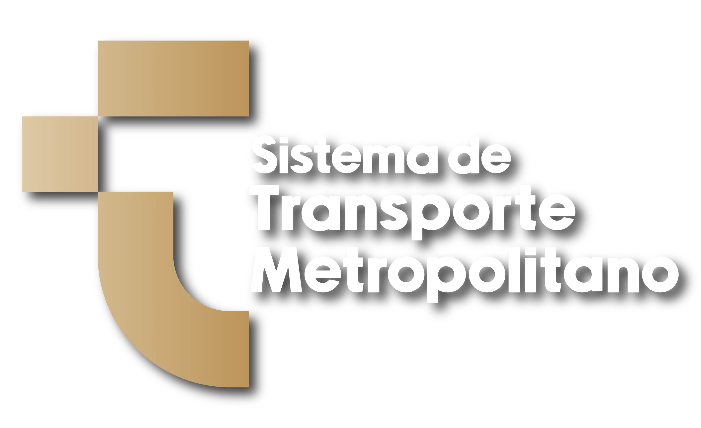

# Sistema de Despacho y Gestión de Flota - SITMAH

> **SITMAH** (Sistema de Transporte Metropolitano de Hidalgo)

<div align="center">
  
  
</div>

Este proyecto es una plataforma web integral diseñada para la gestión, inspección preoperativa (checklist), control de despacho en tiempo real y generación de reportes generales y específicos para la flota del Sistema de Transporte Metropolitano de Hidalgo.


---


## Tecnologías y Desarrollo

El sistema está construido sobre una arquitectura moderna desacoplada en tres componentes principales:

### 1. Frontend (React)
Interfaz de usuario de alto rendimiento, reactiva y optimizada:
*   **Core:** React 19 + JavaScript (Vite como empaquetador y servidor de desarrollo).
*   **Estilos:** Tailwind CSS v4 para un diseño premium, moderno y responsive, complementado con CSS nativo.
*   **Rutas:** React Router v7 para una navegación rápida tipo Single Page Application (SPA).
*   **Componentes Visuales:** SweetAlert2 para diálogos modales dinámicos, Recharts para gráficos de métricas operativas.
*   **Documentación y Datos:** jsPDF y jsPDF-AutoTable para la exportación de checklists y reportes en PDF, XLSX (SheetJS) para la lectura y procesamiento de archivos Excel.

### 2. API Principal (Laravel)
Backend de servicios robusto y de alto rendimiento:
*   **Framework:** Laravel 13 con PHP 8.3+.
*   **Seguridad y Autenticación:** Laravel Sanctum para el control de acceso basado en tokens seguros de API.
*   **Base de Datos por Defecto:** PostgreSQL / Neon (la configuración de drivers se encuentra disponible y activa en `.env`).
*   **Soporte Multi-Base de Datos:** Preparado para SQLite, MySQL y otros cambiando la configuración.

### 3. Backend de Soporte (Node.js)
Servicio alternativo auxiliar ligero:
*   **Plataforma:** Node.js con Express, CORS y Dotenv.
*   **Propósito:** Servidor de soporte rápido/Mock API (ejecutándose en el puerto 4000).

---

## Estructura del Repositorio

El proyecto está organizado en las siguientes carpetas:

```text
Sistema_de_Despacho/
├── frontend/             # Código fuente de la interfaz de usuario en React
├── laravel-api/          # API REST principal del sistema (Laravel)
├── backend/              # Microservicio auxiliar en Node.js (Express)
├── logs/                 # Registro y bitácoras en tiempo real de cada servicio
├── database/             # Esquemas de base de datos SQL adicionales
├── run-dev.sh            # Script de inicialización automática en paralelo
└── start.sh              # Script alternativo de arranque en segundo plano
```

---

## Requisitos Previos

Antes de comenzar, asegúrate de tener instalado en tu sistema:
1.  **Node.js** (v18 o superior recomendado)
2.  **PHP** (v8.3 o superior recomendado)
3.  **Composer** (gestor de dependencias de PHP)
4.  **Base de Datos** (La conexión hacia PostgreSQL/NeonDB ya viene preconfigurada, no requieres base local salvo que desees cambiarla).

---

## Instalación y Configuración

Sigue estos pasos para instalar las dependencias e inicializar el entorno:

### 1. Clonar el Repositorio e Instalar Dependencias

Instala los módulos necesarios en cada uno de los subproyectos:

```bash
# Entrar al frontend e instalar dependencias
cd frontend
npm install

# Entrar al backend Node e instalar dependencias
cd ../backend
npm install

# Entrar a la API de Laravel e instalar dependencias
cd ../laravel-api
composer install
```

### 2. Configurar el Entorno del Backend Laravel

1.  Copia el archivo de ejemplo de variables de entorno:
    ```bash
    cp .env.example .env
    ```
2.  Genera la clave de seguridad del proyecto:
    ```bash
    php artisan key:generate
    ```
3.  Ejecuta las migraciones en tu base de datos (por defecto apuntando a PostgreSQL/Neon):
    ```bash
    # Ejecutar las migraciones
    php artisan migrate
    ```

---

## Levantando los Servicios

Para facilitar el desarrollo, el proyecto cuenta con scripts que inician de forma automática los tres servidores en simultáneo:

### Opción 1: Consola interactiva (Recomendado)
Ejecuta el script principal de desarrollo en la raíz del proyecto. Este mantendrá la consola abierta mostrando los logs y la información de red, y te permitirá cerrar todo presionando `Ctrl+C`:

```bash
bash run-dev.sh
```

### Opción 2: Procesos en Segundo Plano
Alternativamente, puedes levantar los procesos en segundo plano usando el script de arranque básico:

```bash
bash start.sh
```

### Puertos y Accesos por Defecto

Una vez iniciados los servicios, podrás acceder a ellos a través de las siguientes URLs locales:

*   **Aplicación Frontend (React):** [http://localhost:5173](http://localhost:5173)
*   **API Principal (Laravel):** [http://localhost:8000](http://localhost:8000)
*   **Servicio Opcional (Node.js):** [http://localhost:4000](http://localhost:4000)

---

## Módulos y Roles del Sistema

El sistema implementa un esquema de permisos basado en roles de usuario (rol_id):

*   **ADMINISTRADOR:** Acceso completo al sistema, creación y edición de usuarios, carga de datos y visualización de reportes avanzados.
*   **DESPACHO:** Control operativo de las unidades en ruta y asignación de despachos diarios.
*   **CAPTURISTA:** Importación y actualización de programaciones de rutas desde archivos Excel.
*   **ENCIERRO:** Realización de checklists mecánicos y de seguridad de los vehículos directamente en los patios de resguardo.
*   **CENTRO_CONTROL:** Visualización en tiempo real del estatus, la operatividad y la ubicación estimada de toda la flota de transporte.

### Tipos de Flotas Soportadas
El sistema cuenta con flotas parametrizadas con imágenes específicas para registrar incidencias en diferentes partes de las unidades (frente, lateral y trasero):
*   **URBANUSS** 
*   **VAGONETA** 
*   **ZAFIRO** 
*   **ORION** 

---

## Monitoreo de Logs

Los logs en ejecución se almacenan en la carpeta `/logs` de la raíz del proyecto. Puedes monitorear la actividad del sistema con:

```bash
# Ver logs en tiempo real
tail -f logs/Frontend.log
tail -f logs/Laravel\ API.log
tail -f logs/Backend\ Node.log
```
